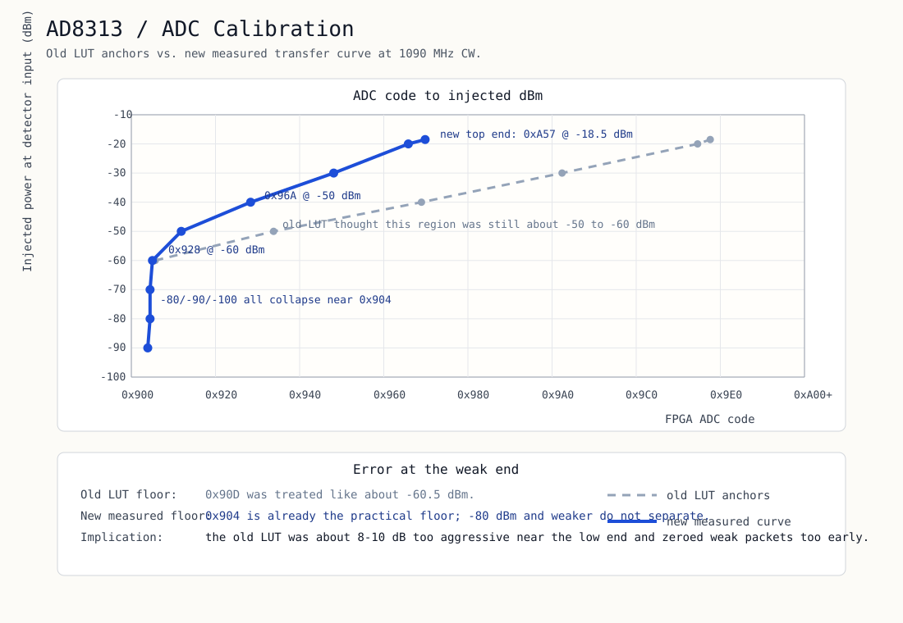

# Log-Detector Front-End Calibration

This note records the bench calibration used by the current `log_to_linear.vhd`
LUT for the AD8313 + AD8132 + AD9238 front-end.

Related files:
- [hdl/rtl/log_to_linear.vhd](/home/shanes/plane_watcher/hdl/rtl/log_to_linear.vhd)
- [docs/generated/ad8313_lut_calibration.svg](/home/shanes/plane_watcher/docs/generated/ad8313_lut_calibration.svg)

## Summary

- Calibration was done at `1090 MHz` with CW injection at the detector input.
- LUT fitting is done in actual FPGA ADC-code space, not by trying to model the
  analog stages separately.
- The strong/mid end was already roughly right.
- The important correction was the weak end: the old LUT floor was too
  aggressive and effectively threw away about `8-10 dB` of weak-signal range.

## Measured Curve

| Injected level | ADC center code | Notes |
|---|---:|---|
| `-100 dBm` | `2307.5` | floor |
| `-90 dBm` | `2310.0` | floor |
| `-80 dBm` | `2306.0` | floor |
| `-70 dBm` | `2310.0` | barely above floor |
| `-60 dBm` | `2344.0` | first clearly rising point |
| `-50 dBm` | `2410.0` | clean anchor |
| `-40 dBm` | `2489.0` | clean anchor |
| `-30 dBm` | `2560.0` | clean anchor |
| `-20 dBm` | `2630.5` | clean anchor |
| `-18.5 dBm` | `2646.5` | top-end anchor |

## Practical Floor

`-80`, `-90`, and `-100 dBm` all collapse into the same narrow ADC-code region
around `0x904`. That is the practical floor of this analog chain. Below that,
the front-end is no longer providing meaningful separation.

Current LUT behaviour:
- clamp low at about `0x904`
- interpolate from `0x928 -> -60 dBm`
- clamp high above `0xA57 -> -18.5 dBm`

## Why The LUT Changed

The previous LUT treated roughly `0x90D` as about `-60.5 dBm`. Bench data
showed that this was wrong: the chain is already on the floor there. In
practice that meant weak packets were being zeroed too early.

The current LUT instead uses:
- measured floor around `0x904`
- measured anchors from `-60 dBm` through `-18.5 dBm`

See the updated plot:

## Analog Sanity Checks

The AD8132 differential driver was checked and appears sane:
- output common-mode around `1.67 V`
- both outputs move as a balanced differential pair
- no obvious bias fault was found in the detector-to-ADC driver stage

So the remaining performance work is more likely in:
- low-end sensitivity allocation
- preamble gating / thresholding
- frontend noise / interference behaviour

## Next Work

After this LUT update, the next investigation should focus on preamble quality
gates and detector thresholds rather than more ADC-driver debugging.
