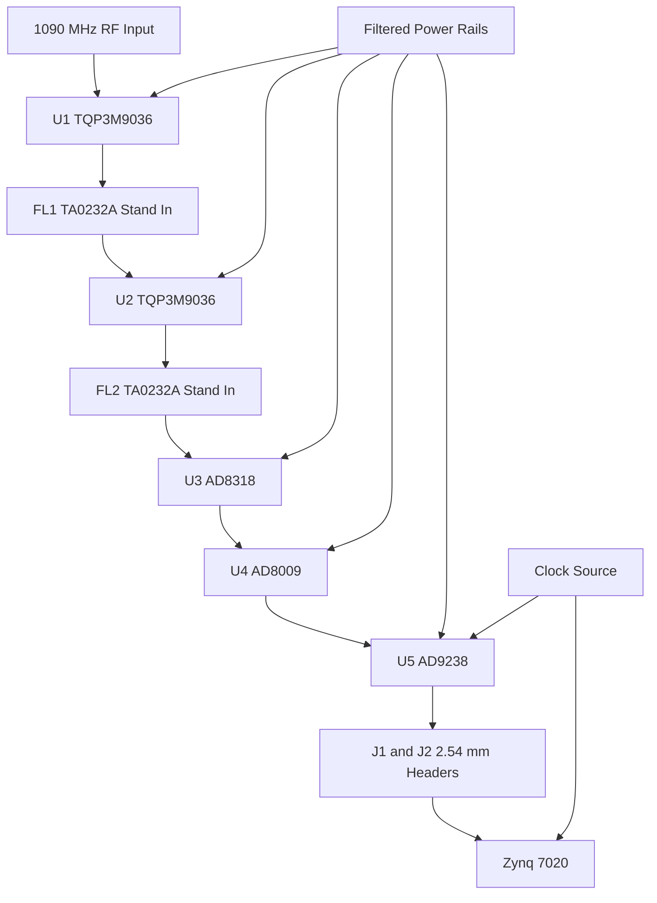

# Project Specification

## Design Summary
**Status:** Requirements Baseline Locked

**Manufacturing target:** Prototype bring-up

**Software / firmware:** TBD

---

## Scope

**Purpose**

Create an ADS-B 1090 MHz receive frontend and digitization chain that converts filtered RF energy into sampled digital data for a Zynq-7020 FPGA through 2.54 mm headers, with this revision locking the requirements baseline for the next schematic and layout pass.

**In scope**

- Dual [TQP3M9036](https://www.flux.ai/search?type=components&q=f36389d9-06ca-4124-9afb-4d877669ff31) LNA stages with bias and decoupling
- Dual TA0232A stand-in SAW filter stages in the RF chain for prototype bring-up
- [AD8318ACPZ-REEL7](https://www.flux.ai/search?type=components&q=2ac3911a-dfbe-4c5e-a220-de02dad5b15c) detector stage
- [AD8009ARZ-REEL](https://www.flux.ai/search?type=components&q=09e55d29-323d-4da7-a4d6-e0c776667630) gain and buffering stage
- [AD9238BSTZ-65](https://www.flux.ai/search?type=components&q=061e7d38-6b45-48d5-b20e-4e22d89ca88c) ADC, clocking, references, and digital header breakout
- Power rail filtering and decoupling for RF, analog, and converter sections

**Out of scope**

- Final Zynq-7020 bank-specific FPGA pin assignment
- Final production SAW filter swap and insertion-loss optimization beyond the TA0232A stand-in baseline

---

## System context

This project is a frontend capture board for 1090 MHz ADS-B signals. It amplifies and filters the received RF signal, keeps the detector output in the main signal-processing chain, conditions it for digitization, and exports sampled data and timing signals to a downstream Zynq-7020 processing platform.

**Key interfaces**

- RF input from external 1090 MHz antenna path
- Header-provided VCC assumed to be 5 V for this baseline, with 3.3 V also available for auxiliary and support circuitry
- ADC sample clock source
- 2.54 mm header interface carrying ADC data, clock, control, and grounds to Zynq-7020

**Block diagram**

---

## Requirements

### Functional

- The board shall implement the signal chain TQP3M9036 -> TA0232A stand-in -> TQP3M9036 -> TA0232A stand-in -> AD8318 -> AD8009 -> AD9238.
- Both AD9238 channels shall be treated as active resources in the architecture baseline.
- The detector path shall remain integrated in the main data path rather than treated as a side-channel monitor only output.
- The board shall expose ADC digital data, clock, and control signals through 2.54 mm headers for connection to a Zynq-7020 FPGA platform.
- The board shall include all required interconnects, biasing, supply decoupling, and clock distribution needed for schematic completeness.

### Electrical

- RF center frequency: 1090 MHz.
- RF interstage environment shall preserve nominal 50 ohm signal interfaces where the selected parts expect them.
- Supply assumption for this baseline is header-provided VCC treated as 5 V, with 3.3 V also available for auxiliary and support functions.
- TQP3M9036 stages operate from 3.3 V to 5.0 V and use RF choke bias injection with AC coupling.
- AD8318 requires 4.5 V to 5.5 V supply with equal VPSI and VPSO potentials and local 100 pF plus 0.1 uF decoupling per supply grouping.
- AD9238 target sample rate: 65 MSPS configuration.
- ADC to FPGA interface shall include at minimum 12 data signals, output clock, and control pins with sufficient ground return pins.

### Mechanical / environmental

- No mechanical enclosure constraints provided yet.
- FPGA connection uses standard 2.54 mm through-hole headers.

---

## Key constraints

- TA0232A is used as the current stand-in for the intended SAW filter position. This is accepted for prototype bring-up, with the tradeoff that insertion loss may differ from the originally intended production filter.
- Mixed-signal grounding should use a common low-impedance ground system instead of isolated split grounds unless later measurement data proves otherwise.
- RF and converter supplies should prioritize low-noise filtering and local decoupling.
- ADC reference and clock nets must be treated as noise-sensitive.

---

## Dependencies and risks

**Dependencies**

- Exact Zynq-7020 I/O bank mapping is deferred.
- Exact ADC clock source part may be finalized later if a preferred oscillator is provided.

**Key risks**

- RF performance will depend strongly on final PCB layout and impedance control, which are outside this schematic-only phase.
- Header-based ADC export may limit signal integrity margin if trace routing and ground allocation are poor.
- TA0691A library availability gap may require later cleanup.

---

## Validation

**Success criteria**

- Schematic contains all required signal-chain stages and support components.
- Power, bias, coupling, filtering, and clocking connections are represented.
- ADC and FPGA interface signals are named clearly on 2.54 mm headers.
- PCB uses a 4-layer stackup with an uninterrupted internal reference plane under the RF path.
- RF placement remains linear from input through detector, with the SAW and LNA stages placed as tightly as practical.
- RF routing is reserved for 50 ohm controlled-impedance traces with dense ground stitching and via fencing around the RF corridor.

**Planned checks**

- Schematic connectivity review against datasheet pin functions
- ERC review for floating and missing power connections
- Later lab verification of gain, noise, and pulse-detection performance

---

## Release-facing notes

**Expected deliverables**

- Schematic
- Preliminary BOM-ready component set
- Interface definition for FPGA connection

**Special release notes**

- TA0232A stand-ins are intentionally retained for the current prototype-oriented baseline.
- Final board should include RF and analog testpoints during layout stage.

---

## Change notes / open questions

**Changes in this revision**

- Locked the RF receive partition as RF input -> LNA1 -> SAW1 -> LNA2 -> SAW2 -> logarithmic detector -> post-detector amplifier -> ADC, with detector output remaining in the main data path.
- Locked the SAW-filter substitution policy: TA0232A is the approved stand-in for both filter positions during prototype bring-up.
- Locked the power assumption: header-provided VCC is assumed to be 5 V until board arrival confirms otherwise, and 3.3 V is also available.
- Locked the LNA control policy: shutdown pins are to remain always active.
- Locked the ADC baseline: both channels are intended to be used, even if exact downstream use evolves later.
- Updated LNA output-bias guidance to match the TQP3M9036 evaluation approach: 68 nH output choke, 100 pF RF coupling capacitors, 1 uF local bias bypass, and optional shutdown network using 33 k pull-up with a logic override only if shutdown is required.
- Added AD8318 front-end requirements: INHI ac-coupled through 1 nF, INLO ac-coupled to ground through 1 nF, ENBL held high for active operation, VOUT tied to VSET in measurement mode, and CLPF intentionally left open unless lower video bandwidth is desired.
- Added AD9238 requirements: matched source impedance into VIN+ and VIN-, midsupply common-mode at the analog input, 0.1 uF plus 10 uF reference decoupling on REFT and REFB, clocks for channels A/B kept phase-aligned, and unused channel controls driven to known states.
- Recorded that the Bank 33 FPGA interface constraint comes from the uploaded header image and that the top header is labeled BANK 33.

**Open questions**

- Which exact ADC clock source part should be used?
- Exact implementation of Channel B capture path and post-detector distribution into both ADC channels during the next schematic pass.

## RF frontend review notes

### Architecture validation

- The dual-LNA, dual-SAW ordering is appropriate for a 1090 MHz ADS-B front-end when the design goal is to combine low sensitivity threshold with stronger out-of-band rejection before the detector.
- The current requirements baseline explicitly balances RF performance against practical bring-up: preserve the two-stage filtered RF chain, but allow TA0232A stand-ins and header-based FPGA interfacing for the first prototype revision.
- The preferred partition is:
  - first LNA establishes low noise figure,
  - first SAW limits blocker energy before the second gain stage,
  - second LNA recovers insertion loss,
  - second SAW cleans the spectrum before detection.
- The AD8318 should be treated as an RF power/envelope detector, not a narrowband IF gain block. Its output is a detected baseband envelope that then feeds the AD8009 / ADC path.

### Matching, biasing, and filter placement

- Keep every interstage interface nominally 50 ohm unless a later bench-tuned matching network proves necessary.
- Place the first SAW immediately after LNA1 and the second SAW immediately after LNA2 with the shortest possible interconnects.
- The TQP3M9036 output-bias injection should be implemented with the choke connected at the RF output node, followed by very local shunt bypass to ground on the bias side of the choke.
- The shutdown network should be implemented such that both LNA shutdown pins are held in their always-active state for this revision; no dynamic shutdown control is required.
- Any shunt RF tuning capacitors added for return-loss optimization must be treated as layout-sensitive placeholders and tuned on hardware at 1090 MHz.

### Power, decoupling, and isolation guidance

- Do not daisy-chain the RF bias nodes of the two LNAs through a shared inductive path; each LNA stage should have its own local choke and its own local 1 uF plus high-frequency bypass return.
- Keep detector, op-amp, and ADC supply decoupling local to each IC with a direct low-inductance return into the ground plane.
- Use one continuous ground system with careful current-path control rather than split analog/RF/digital islands.
- Keep ADC clock and reference decoupling physically isolated from the LNA bias chokes and RF trace corridor.
- Reserve shielding or via-fence space around the RF path during layout.

### Pre-layout schematic checklist

- RF nets should be distinct and named by stage boundary: RF_IN, RF_SAW1_IN, RF_SAW1_OUT, RF_LNA2_IN, RF_SAW2_IN, RF_DET_IN, RF_DET_COM.
- All LNA bias nets should remain separate from pure RF through-path nets.
- AD8318 ENBL, VSET, TADJ, and CLPF must each be given an intentional state; leaving them floating is not acceptable.
- AD8009 inputs, output, disable, and supply bypassing must be fully defined before layout.
- AD9238 reference, clock, unused-channel, and input common-mode connections must be finalized before PCB work.
- The FPGA breakout is acceptable for prototype use only; preserve heavy ground allocation around the Bank 33 header signals.

## Layout readiness updates

- The uploaded PCB reference image confirms the intended placement style: compact linear RF flow, short and direct controlled-impedance traces, dense ground stitching, and decoupling placed immediately at each active RF device.
- The locked baseline for the next pass is therefore: optimize the RF corridor as if targeting best practical 1090 MHz behavior, while accepting prototype concessions only where they materially improve bring-up speed.
- The Bank 33 breakout reference confirms the top FPGA interface is a single 2x20 header organization rather than multiple separate headers.
- The project layout now targets the existing 4-layer stackup with an internal solid reference plane to support low-inductance return paths under the RF chain.
- Critical RF and mixed-signal devices are marked for protected placement with explicit keepout margins so the frontend can be spread linearly and routed with minimal bends.
- Final completion still requires manual trace routing, via-fence placement, and closure of unresolved schematic floating pins on the op-amp path, ADC analog input path, and any intentionally unused breakout placeholders.

## PCB readiness checklist

- RF through-path nets are separated from bias and supply nets; the former merged RF_LNA2_OUT_BIAS mega-net has been split so U1/U2 RF outputs no longer share a net with detector, op-amp, or ADC supply pins.
- AD8318 supply and control intent is now defined for PCB work: VPSI and VPSO share the 5 V analog rail, ENBL is asserted high, VOUT is looped to VSET for measurement mode, and TADJ is assigned to a compensation resistor node.
- AD9238 support intent is partially defined for PCB work: AVDD and DRVDD are assigned to the analog rail, Channel B control pins are driven to known states for disable / bus tri-state, and the internal 0.5 V reference mode is selected by tying SENSE to VREF.
- Reference decoupling nodes for REFT_A and REFB_A are assigned and ready for local capacitor placement verification.
- RF and mixed-signal placement remains protected for a linear antenna -> LNA1 -> SAW1 -> LNA2 -> SAW2 -> detector -> op-amp -> ADC physical flow.
- Layout remains on a 4-layer stackup with the first inner layer configured as a plane layer to support controlled return current beneath the RF corridor.
- Final manual tasks before production release:
  - route all airwires, especially ADC, detector, and bias nets,
  - place dense ground stitching and via fencing along both sides of the RF corridor,
  - complete the AD8009 input/output network and ADC analog input termination,
  - remove any lingering J3 connectivity residue from the ground net,
  - verify the FPGA breakout matches the intended Bank 33 header organization.
